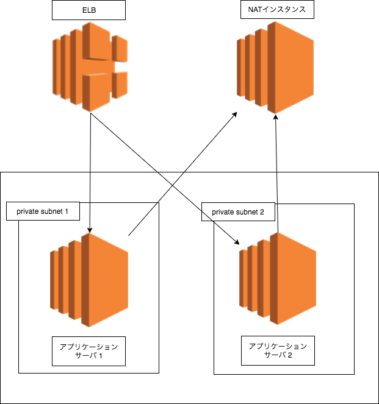

ELB + nginx + NATインスタンスの構成でハマった件について。

EC2のインスタンスはELBからのアクセスを受け付けて外に出る時はNATを通す、という単純な構成をしたかったのだけれどもうまく行かなかったからその失敗談。

簡単に図で説明すると以下のような構成にしたかった。

いろいろなサイトを参考にしてやってたのだけれど以下のような状況が発生した

- ELBからnginxへのヘルスチェックは常に来ている
- NATインスタンスを通してprivateなAZから外に通信させようとするとWEBの表示ができなくなる
- privateサブネットとpublicサブネットを関連付けたりするもうまく行かず。

結局原因はELBに設定しているAvailabilityZoneの問題だった。

解決方法としては

- ELBのAvailabilityZoneにpublic subnetを設定する
- VPCからサブネットの関連付けは全て解除する
- private subnetにルートテーブルでNATを設定する
- public subnetはルートテーブルでインターネットゲートウェイを設定する

とやったらNATを外に出てELBから内部のサーバに割り振られるようになった。

間違いだったのはELBにprivateなsubnetを設定していたせいだったようだ。
