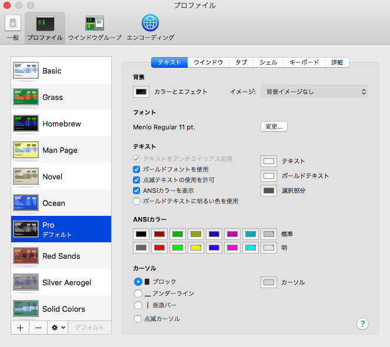

MAC標準のターミナルを使っていて背景に黒のスキーマを選んでいたけどカーソルが薄暗いグレーでvimでvsplitしまくる人間としてはカーソルがどこにあるかすぐ見失っていた。 そんなわけでカーソルを変えようとvimの設定を変えようとしてみるも変わらない。

最終的にMACのターミナル自身の設定で変えられることがわかった。

メニューからターミナル->環境設定画像のカーソルの部分の色をクリックで変えられる。

